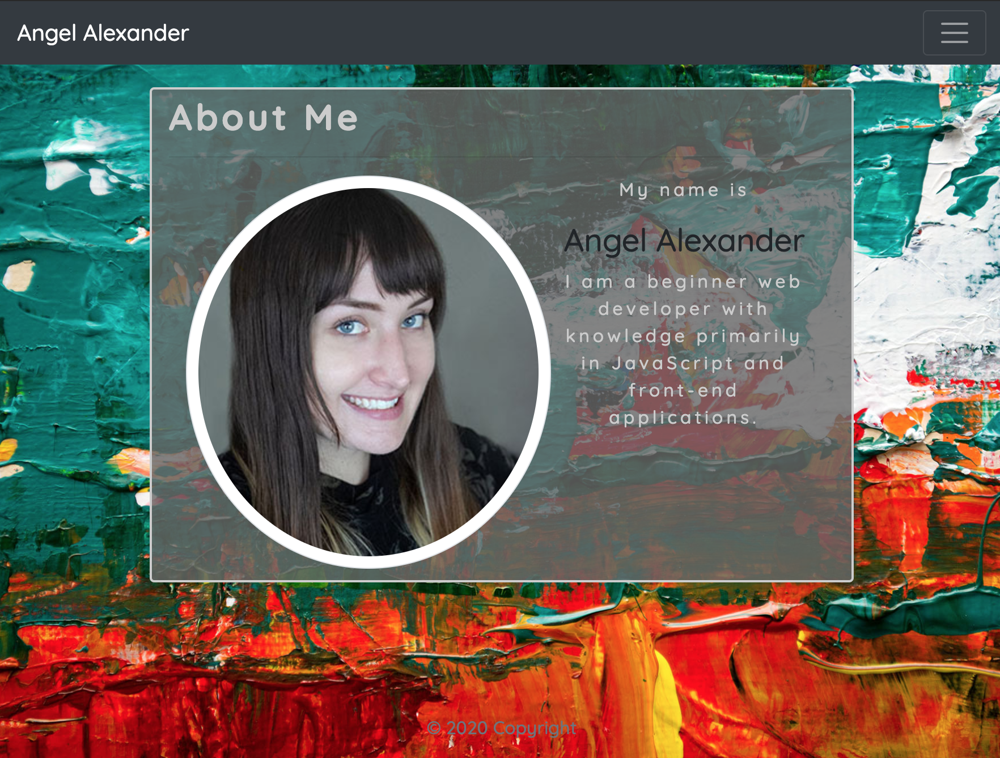

# Updated Portfolio

This application shows the skills I have accumulated throughout my experience during the Northwestern Coding Bootcamp as well as my:

1. [Portfolio](https://analexander.github.io/Updated-Portfolio/)
2. [GitHub Profile](https://github.com/analexander)
3. [Resume](https://docs.google.com/document/d/e/2PACX-1vRIDbxm8dCUo8dCUXuqeNqHuIv-RgfXakkY2m0QcuETLT1fyBXTWUoihEOijebva6fRYUcEJVCUPfjp/pub)
4. [LinkedIn](https://www.linkedin.com/in/angel-alexander-1171571a5/)

I have included my first project and two other homework assignments that I thought were my best works so far in the class.

